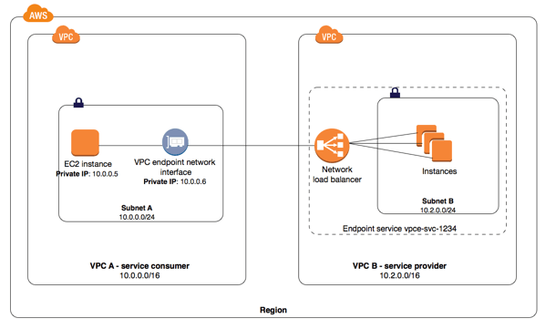
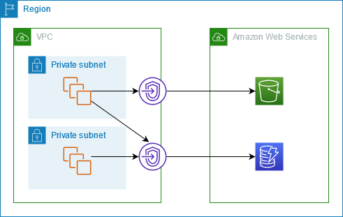

# VPC Endpoint

A VPC endpoint is a secure, **regional network feature** that allows private communication between your VPC resources and select AWS services, using private IPs within the AWS network. **No need for NAT device, VPN, internet gateway, or Direct Connect.** Benefits: secure, regional, private communication, **no public IPs or leaving AWS network.**

## Two Types

### 1) Interface endpoints: 
These endpoints facilitate communication **with a wide range of supported services** and keep the traffic within the AWS cloud. As VPC interface endpoints **utilize PrivateLink**, you'll be charged for those endpoints by the hour and by the introduced data transfer.

### 2) Gateway endpoints: 
Designed for specific services, gateway endpoints also ensure traffic remains within the protected AWS network. Currently, **only Amazon S3 and Amazon DynamoDB are supported.** Gateway endpoints don't introduce any additional costs.

